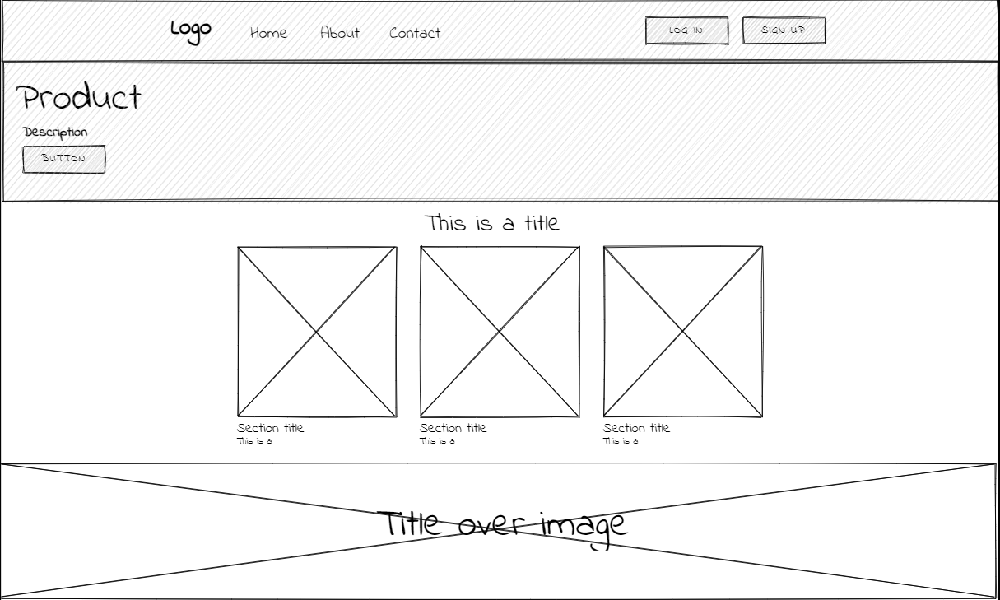
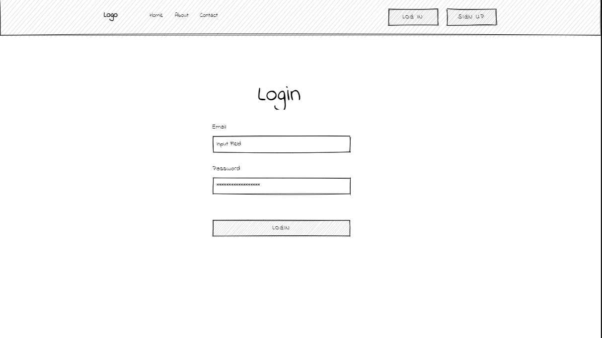
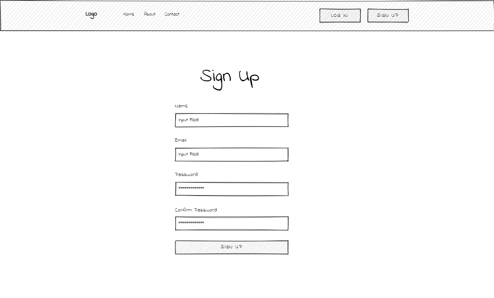
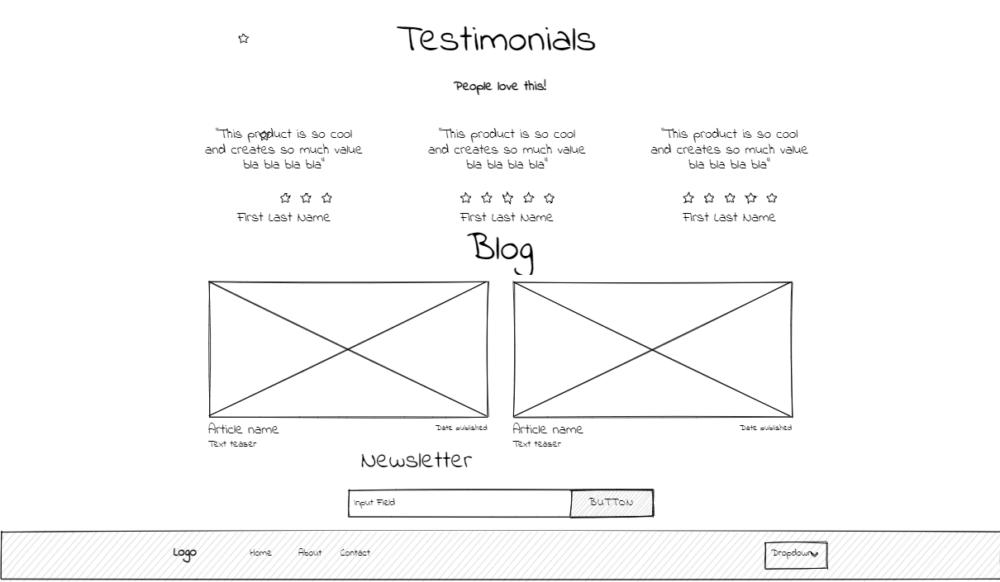
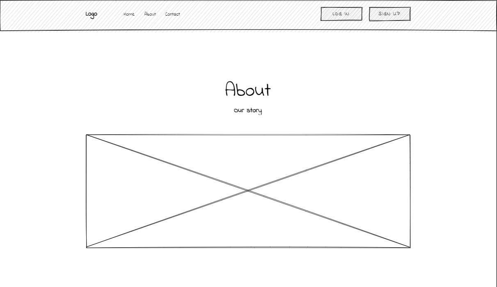
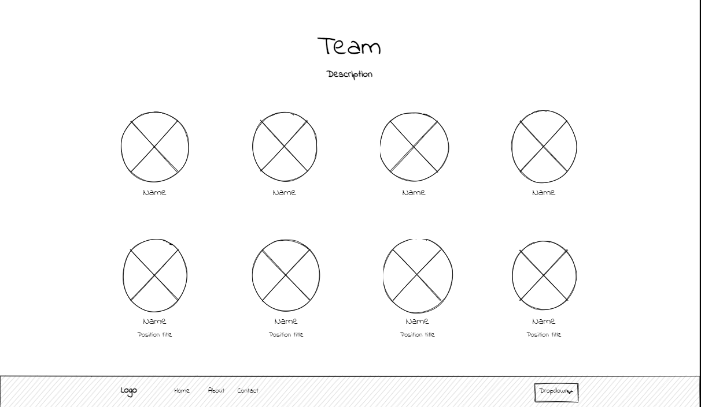
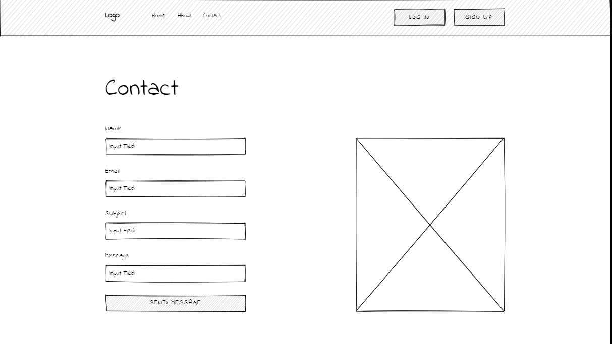
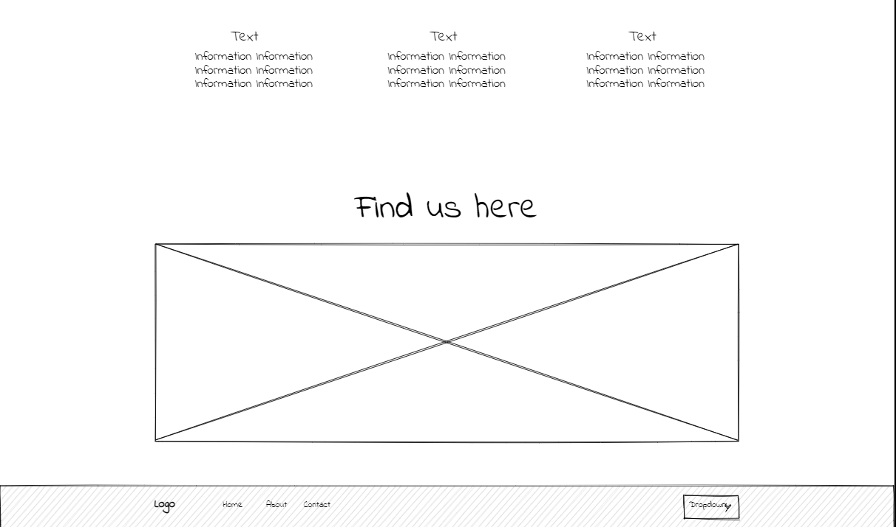
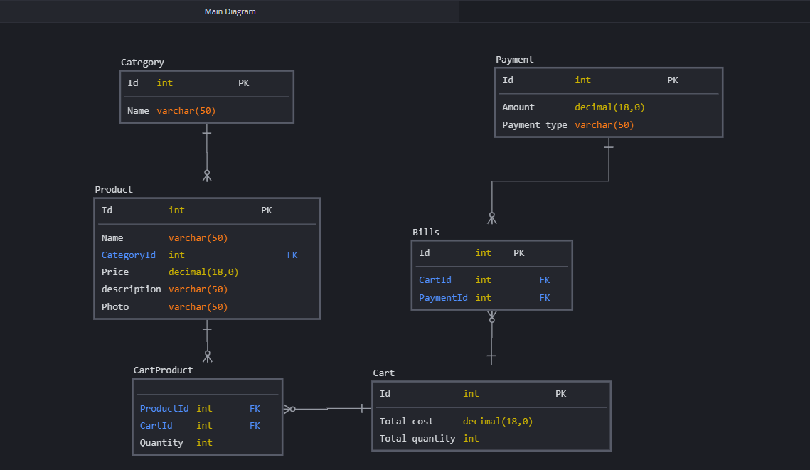

# E-Commerce-App

## Introduction

This is an e-commerse website build for selling of any products online. In this project we have mainly considered to adding the products to the users cart and again let them decide the amount of item to buy. The users can increase or decrease the items amount in the cart. After that the user may pay and get the order successful. The Project also uses the mail facilities to the users.

## Problem Domain

With the rapid progress and development of technology and communication, we have to ensure that we automate all ideas and creative projects we may have, we should keep track with the updates happen everyday in the world of technology field, besides these days all activities should be done quickly.

from this point and because we belive that selling and buying is part and parcel in our life, it's an important operation we do every day, we decide to help people by creating an online website that they can sign up and explore categories with all related products details like: name of product from which category does it came, and other informations customer may need to complete shopping operation, he/she will have a message when they for example do something wrong like search for product we don't have and so on.

## Wireframes

- Home Page

- Login Page

- Sign Up Page

- Details Page

- Footer Page

- About Page

- Team Page

- Contact Page

- Find Us Page

## ER digram

## User Stories

- As an admin user, I would like to have a dashboard where I can see a list of product categories
- As an admin user, I would like to view a detail page for each category so that I can eventually edit its data or delete it
- As an admin user, I would like to see a list of the products assigned to a category on the category details page
- As an admin user, I would like a detail page for each product so that I can eventually edit its data or delete it
- As an administrator I would like add and save a new category so that I can expand my product lines
- As an administrator I would like add and save a new product so that I can expand my inventory
- As an administrator I would like to associate a product to a category so that my users can more easily browse our inventory
- As an administrator I would like to be able to delete products and categories as needed
- As an administrator I would like to be able to edit/modify categories so that I can change my storefront structure in real time
- As an administrator I would like to be able to edit/modify products so that I can change my inventory in real time