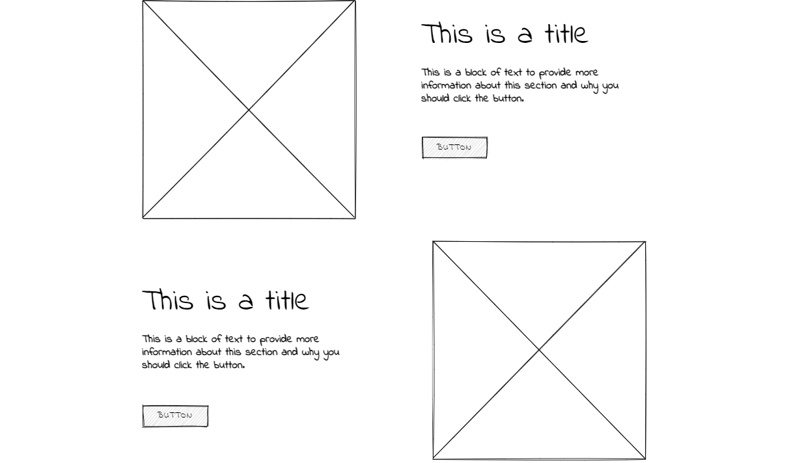

# E-Commerce-App

## Introduction

This is an e-commerse website build for selling of any products online. In this project we have mainly considered to adding the products to the users cart and again let them decide the amount of item to buy. The users can increase or decrease the items amount in the cart. After that the user may pay and get the order successful. The Project also uses the mail facilities to the users.

## Problem Domain

With the rapid progress and development of technology and communication, we have to ensure that we automate all ideas and creative projects we may have, we should keep track with the updates happen everyday in the world of technology field, besides these days all activities should be done quickly.

from this point and because we belive that selling and buying is part and parcel in our life, it's an important operation we do every day, we decide to help people by creating an online website that they can sign up and explore categories with all related products details like: name of product from which category does it came, and other informations customer may need to complete shopping operation, he/she will have a message when they for example do something wrong like search for product we don't have and so on.

## Wireframes

- Home Page

- Login Page

- Sign Up Page

- Details Page

- Footer Page

- About Page

- Team Page

- Contact Page

- Find Us Page

## ER digram

## User Stories

- As an admin user, I would like to have a dashboard where I can see a list of product categories
- As an admin user, I would like to view a detail page for each category so that I can eventually edit its data or delete it
- As an admin user, I would like to see a list of the products assigned to a category on the category details page
- As an admin user, I would like a detail page for each product so that I can eventually edit its data or delete it
- As an administrator I would like add and save a new category so that I can expand my product lines
- As an administrator I would like add and save a new product so that I can expand my inventory
- As an administrator I would like to associate a product to a category so that my users can more easily browse our inventory
- As an administrator I would like to be able to delete products and categories as needed
- As an administrator I would like to be able to edit/modify categories so that I can change my storefront structure in real time
- As an administrator I would like to be able to edit/modify products so that I can change my inventory in real time

## User experience

Pre-planning the project by understanding the requirements of the project before implementation, creating an er diagram for the project and understanding the relationships between tables, understanding user stores, and creating a complete project correctly and properly organized by using dependency injection (DI) software design pattern, which is a technique for achieving Inversion of Control (IoC) between classes and their dependencies, And using Data Transfer objects(Dto's) is a data container for moving data between layers, Create Wireframes for all site pages.
Deployed my project in Azure cloud engineer. And also using Azure services such as Azure storage to upload all pics used in the project in it.
After I did Pre-planning the project by understanding the requirements of the project before implementation, creating an er diagram for the project, and understanding the relationships between tables.

I started to create a User Interface (UI) by using  Razor Pages, So users can see all products and browse the website without even needing to log in, But if users want to shop and buy stuff need to log in if a user doesn't have an account can create one, After that user can have own cart, Can delete the product and add one there are all details show in his cats like total cost and total quantity, After that customer need to fill shipping form like address and phone number email user name, After that we sent to user invoice have all order details in his email after confirming the order by using Azure services SendGrid to sent email to the user finally user have thanks page , If user facing any problem in this experience can easily contact us.

## Azure deployment 

[Bazar App](https://bazaarapp.azurewebsites.net/)
